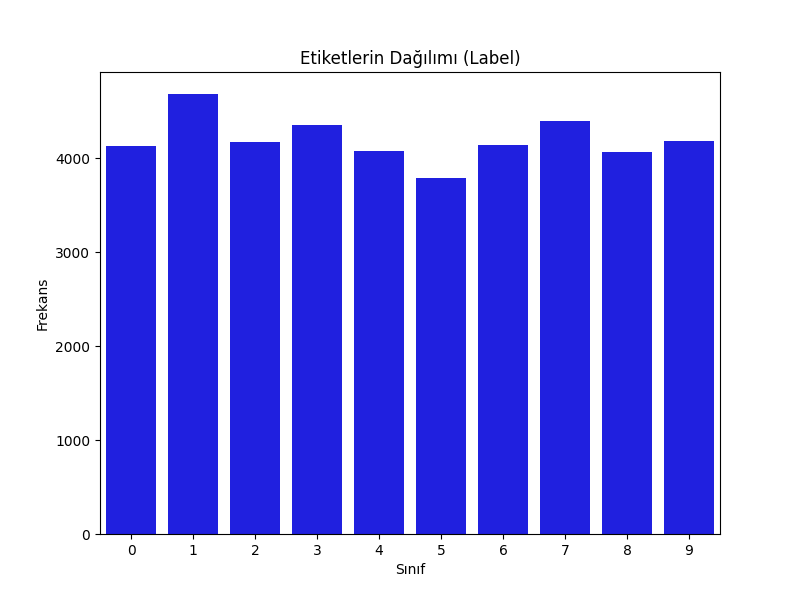
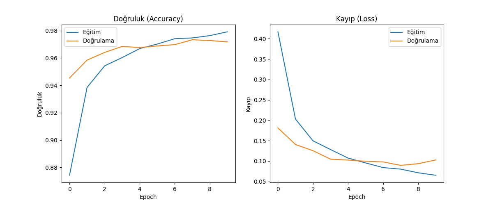

# DigitRecognizer
Yüksek Düzey Programlama Ödev

# Digit Recognizer Project

## Proje Hakkında
Bu proje, Kaggle'ın **Digit Recognizer** veri seti kullanılarak el yazısı rakamları sınıflandırmayı hedefler. Yapay sinir ağı (ANN) kullanılarak eğitim ve test işlemleri gerçekleştirilmiştir.

## Kullanılan Teknolojiler
- Python
- TensorFlow ve Keras
- NumPy, Pandas, Matplotlib
- Scikit-learn

## Sonuçlar
Model, eğitim setinde yaklaşık %97 doğruluk ve doğrulama setinde yaklaşık %97 doğruluk elde etti. Kaggle test seti sonuçları `submission.csv` dosyasında bulunabilir.

### Etiketlerin Dağılımı:

### Eğitim ve Doğrulama Doğruluk, Kayıp Grafiği:

## Kullanım
1. `main.py` dosyasını çalıştırarak modeli eğitebilir ve `submission.csv` dosyasını oluşturabilirsiniz.
2. Oluşan dosyayı Kaggle platformuna yükleyerek doğrulama yapabilirsiniz.

## Sonuç Dosyası
- `submission.csv`: Model tarafından oluşturulan tahmin sonuçları.
